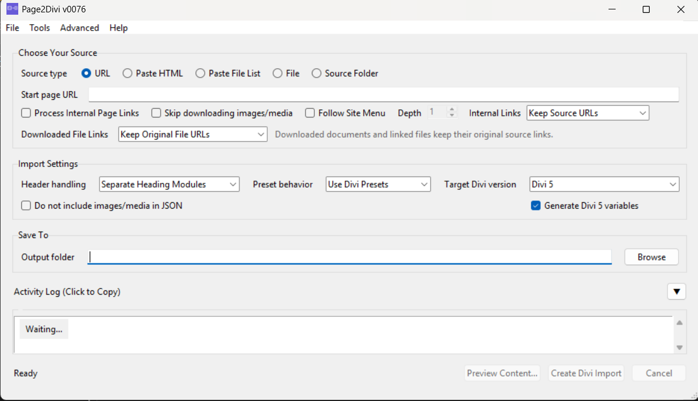

[](https://github.com/remarkablepc/Page2Divi/releases/latest)

# Page2Divi – Binary Releases

> **Download Latest Release:** [v0076](https://github.com/remarkablepc/Page2Divi/releases/tag/v0076)

**Page2Divi is a standalone desktop tool that converts webpages and HTML into Divi-compatible import JSON.**

It rebuilds page structure from live URLs, pasted markup, local HTML / MHTML files, saved-page ZIPs, source folders, WordPress WXR exports, GetSimple CMS XML, and existing Divi 4 / 5 layouts, then writes a `page.json` you import through the Divi Builder's Portability dialog.



_Windows screenshot of the desktop tool. URLs and local output paths are intentionally omitted._

---

## What it does

- Convert **live URLs** (single, batch, or sitemap.xml).
- Handle **JavaScript-heavy pages** with a private browser-assisted retry when the raw HTML is only a hydration shell.
- Convert **pasted HTML** straight from a browser, an editor, or dev tools.
- Convert **local files**: `.html`, `.mhtml`, `.zip` saved-page bundles, WordPress WXR XML, GetSimple CMS XML, or existing Divi 4 / 5 JSON.
- Convert **source folders** with sibling `images` / `assets` so relative links resolve.
- Rebuild the **section / row / column / module skeleton** with per-builder structural mappings.
- Open **Divi-aware compare views** for Preview results, saved exports, and the current source state so structural mismatches are easier to review.
- Preserve useful styling such as **background images and colors**, **padding / margin**, **heading font + size + weight**, **text color**, **alignment**, and **line-height** where the source exposes it.
- Download referenced **images, video posters, and same-site documents** into the output folder so the imported page is self-contained.
- Open the **Conversion Matrix inside the app** through a bundled, self-contained viewer.
- Save and reopen **session profiles (`.p2d`)** so repeat jobs restore the same visible UI settings.
- **Check for Updates** directly from the Help menu.
- Use **advanced browser fallback and debug logging controls** when a page needs rendered capture or deeper troubleshooting.
- Emit **Divi 5 global variables** for supported repeated values and preserved source tokens when Divi 5 export is selected.
- Detect **WooCommerce / JSON-LD / microdata product pages** and emit Divi WooCommerce dynamic modules (`et_pb_wc_*`) plus a static fallback section.
- Run **entirely on your machine** – no telemetry, no login, no cloud.

---

## What it does not do

- It is not a WordPress plugin and does not modify Divi.
- It does **not** create Pages, Posts, Categories, Tags, Menu items, or WooCommerce products. The export is **page content only**.
- It does not produce pixel-perfect copies. Complex builder pages will still need cleanup.
- It does not bundle, redistribute, or download Divi. You bring your own Divi license.
- It is not tied to any account or service.

---

## Why this exists

I wrote Page2Divi because real-world Divi migrations are repetitive and slow. Copying content, rebuilding sections, relinking media, and hand-translating layouts from other builders wastes time before the real design work even starts.

The goal is not a perfect one-click clone. The goal is to give you a solid Divi starting point: structure, content, media, and as much useful styling as the source exposes, produced locally on your machine so you can inspect the output and finish the page properly.

---

## Who this is for

Page2Divi is for people who already work in Divi and want a practical head start.

- Designers and freelancers moving brochure sites into WordPress + Divi  
- Agencies migrating client sites from static HTML, exports, or other WordPress builders  
- Site owners consolidating content from legacy CMSs, saved pages, or existing site backups  
- Developers who want a local conversion tool they can preview, rerun, and troubleshoot without a cloud service  

If you need a pixel-perfect clone, this is the wrong tool. If you need a fast structural conversion that gets real content and media into Divi with much less manual rebuilding, this is what it is for.

---

## New in this release

- Divi-aware compare views in **Preview** and **Tools** so you can inspect source-vs-output structure, warnings, and JSON differences before or after export.
- Saved `.p2d` session profiles for recurring jobs.
- Easier release checks from the **Help** menu.
- Advanced browser fallback and debug logging controls for JavaScript-heavy pages.
- Expanded Google Stitch and Divi 5 coverage, including automatic Divi 5 variable generation for supported repeated fields.

> **Divi 5 variable creation is still a work in progress.**  
> Treat the generated variables as a useful starting point and verify the imported result in Divi 5 before depending on it for production cleanup.

---

# Quick Start

If you just want the shortest path from source page to Divi import, this is it:

1. **Download** the appropriate zip from the [latest release](https://github.com/remarkablepc/Page2Divi/releases/latest).  
2. **Run** it (Windows: extract and double-click; macOS: see the section below for Gatekeeper).  
3. Pick an input – URL, URL list, sitemap, pasted HTML, local file, or source folder.  
4. Pick **Divi 4** or **Divi 5** as the target.  
5. Click **Preview** (parser dry-run) or **Convert** (writes `page.json` + media).  
6. In Divi, use **Portability → Import** on the resulting `page.json`.  

The desktop UI also includes a bundled Conversion Matrix viewer plus an Activity Log that surfaces parser warnings, fallback guidance, copyable troubleshooting notes, and clearer batch summaries for pages that still need manual review.

---

# Download the latest release

All binaries (Windows + macOS) are published on the [Releases page](https://github.com/remarkablepc/Page2Divi/releases).

## Latest release

| Platform | Asset | Notes |
| --- | --- | --- |
| **Windows x64** | Latest Windows zip asset | Single-file `Page2Divi.exe` inside. No installer, no admin required. |
| **macOS (universal2)** | Latest macOS universal2 zip asset | `Page2Divi.app` bundle intended for both Apple Silicon and Intel Macs. Early release and not fully tested – see the macOS notes below. |

---

# Running on Windows

1. Download the Windows zip from the [latest release](https://github.com/remarkablepc/Page2Divi/releases/latest).  
2. Extract the zip. Run `Page2Divi.exe` – no installer, no admin.  
3. SmartScreen may show *"More info → Run anyway"* on the first launch because the EXE is not CA code-signed.

---

# Running on macOS (early release)

> **The macOS build is an early release and hasn’t been fully tested yet.**  
> It builds from the same source tree and the code paths it touches are cross-platform, but Mac-specific behaviour (Gatekeeper, file dialogs, Tk on Retina, etc.) has not been verified end-to-end. Please open an issue if anything breaks.
> On some Intel Macs, the first launch can also take a little longer because macOS has to verify the larger universal app bundle.

1. Download the macOS universal2 zip from the [latest release](https://github.com/remarkablepc/Page2Divi/releases/latest).  
2. Unzip it. You will get `Page2Divi.app`. Move it to `/Applications` (optional but recommended).  
3. The `.app` is **not code-signed or notarized**, so macOS will refuse to launch it on a double-click. To allow it once: **Right-click → Open → Open**.  
4. If macOS still refuses with *"...is damaged and cannot be opened"*, strip the quarantine attribute:

```bash
xattr -dr com.apple.quarantine /Applications/Page2Divi.app
```

### Command-line usage on macOS

```bash
/Applications/Page2Divi.app/Contents/MacOS/Page2Divi --url "https://example.com/page" --divi-version divi4
/Applications/Page2Divi.app/Contents/MacOS/Page2Divi --sitemap "https://example.com/sitemap.xml"
```

A shell alias makes that less painful:

```bash
alias page2divi='/Applications/Page2Divi.app/Contents/MacOS/Page2Divi'
page2divi --url "https://example.com/page"
```

---

## JavaScript-heavy pages and browser-assisted capture

Some modern sites, especially Wix and similar script-heavy stacks, do not expose their real content in the first HTML response. In those cases Page2Divi can offer a **private browser-assisted retry** that captures a rendered snapshot using an isolated browser profile instead of relying on your regular browser session.

That means:

- better results on hydration-shell pages,
- clearer Activity Log messages about when a rendered snapshot was used,
- and less need to manually copy the DOM out of your normal browser.

---

## Builder and platform coverage

WordPress core themes, Gutenberg core blocks, Elementor (live URL + JSON template export), Beaver Builder, Bricks Builder, WPBakery / Visual Composer, Avada / Fusion, Oxygen, Thrive Architect, Astra theme + Spectra / UAGB blocks, Kadence Blocks, Divi 4 / Divi 5 source pages (with module-level Divi 4 to Divi 5 translation), Wild Apricot, Duda, Clicksites.ai, WooCommerce product pages, CMS Made Simple, GetSimple CMS, Joomla, Drupal, Wix / Squarespace / Webflow / HubSpot / Bootstrap-based pages, and plain hand-rolled HTML.

The conversion matrix is available inside the app under **Help → Conversion Matrix**.

---

## Command-line usage (Windows)

The EXE also works as a CLI:

```powershell
Page2Divi.exe --url "https://example.com/page" --divi-version divi4
Page2Divi.exe --sitemap "https://example.com/sitemap.xml" --divi-version divi5
Page2Divi.exe --url-list ".\pages.txt"
Page2Divi.exe --file ".\MySiteExport.zip"
Page2Divi.exe --selftest
Page2Divi.exe --version
Page2Divi.exe --update-check
```

Other useful flags include `--heading-mapping`, `--internal-links`, and `--target-base-url`.

---

## FAQ

### Is this a WordPress plugin?

No. It is a desktop tool that creates Divi-compatible import JSON on your machine. You still import the resulting `page.json` through Divi's Portability dialog.

### Does it send my content anywhere?

No telemetry, login, or cloud service is involved. The only network activity is fetching the URLs you explicitly tell it to fetch.

### Will it make a pixel-perfect copy of my page?

No. The goal is a strong structural starting point: sections, rows, modules, content, media, and useful styling where the source exposes it. Complex builder pages and custom front-end behavior still need cleanup in Divi.

### Why do some pages still need manual review?

Some sites render most of their visible content in the browser after the initial HTML loads. When that happens, Page2Divi may only receive a shell page or incomplete markup. The Activity Log now calls that out more clearly and suggests the next practical fallback.

### What is the `HTML/` folder for?

It is an experimental preview/reference export for inspection and troubleshooting. It is not imported into Divi, but it now tries to stay much closer to the final imported result by using the same locally downloaded media files as the JSON whenever possible. It should still be treated as a reference/debugging aid rather than a pixel-perfect browser clone.

---

## Output

A site-specific folder under `output/<domain>/`:

- `page.json` – Divi import bundle.
- `media/` – downloaded assets used by the export, including referenced images plus same-site documents such as PDF, Office, audio, video, and archive files.
- `HTML/` – experimental preview/reference exports only. These help you inspect what Page2Divi extracted, but they are not imported into Divi. They are intentionally focused on visible layout/content and now prefer the same local media files used by the JSON so the preview is closer to what you will see after import. Runtime script blobs, menus/footers detected as page chrome, and external visual embeds that cannot be localized are stripped or skipped rather than forcing the preview to pull live content.
- A conversion log with parser diagnostics and a text mockup of the emitted layout.

Reruns reuse files already on disk for the same source URL when possible.

---

## Known limitations

- **Pixel-perfect cloning is not a goal**. Complex builder pages, custom JS widgets, and design-token-driven CSS will need manual cleanup.
- **Deeply nested or unusual HTML** may simplify into Text fallback modules; content is kept, structure may flatten.
- **The `HTML/` preview/reference output is still experimental.** It is now closer to the imported JSON because it reuses local media where possible, but it remains a reference/debugging artifact rather than a polished browser-faithful clone.
- **Divi 5 variable creation is still a work in progress.** Supported repeated values can now be linked automatically, but you should still review the imported variables and module bindings inside Divi 5.
- **Some Wix, Wix Studio, and other JavaScript-heavy sites** save or serve a hydration shell first and render the visible page later with client-side scripts. Page2Divi now flags those saves in the Activity Log so the failure mode is clearer, but the fallback is still practical rather than magical: try the live URL first; if prompted, allow the browser-assisted retry; if a saved file still contains only shell markup (`astro-island`, `__NEXT_DATA__`, empty `#root` / `#app`, etc.), capture the rendered DOM from your browser's DevTools (`Elements` → right-click `<html>` → `Copy` → `outerHTML`) and bring that back through **HTML paste**, or save a fully rendered local copy and import it through **Load From File** or **Source Folder**.
- **Elementor galleries** fall back to individual Image modules because Divi's Gallery module needs WordPress attachment IDs.
- **WooCommerce dynamic modules** (`et_pb_wc_*`) only render fully when bound to a real WooCommerce product on the destination site; a static fallback section is always emitted alongside them.
- **macOS build is unsigned and untested**. See the macOS section above.

---

## Future Ideas / Exploratory Concepts

### Site2Divi (Exploratory Concept)

I am exploring a possible future tool called **Site2Divi**.

It would not replace Page2Divi. If it ever proves practical, it would build on the same engine and try to automate more of the full-site workflow for people who need to migrate an entire website into Divi.

Because that concept would involve creating WordPress pages, uploading images, rewriting internal links, and performing authenticated REST API operations, it would require a WordPress App Password. This is not optional. Page2Divi will remain offline and login-free.

It is still a very early idea and may never go further than exploration, but the rough concept would be:

- WordPress App Password authentication (required)
- Crawl a site's internal pages (following menus or sitemap)
- Convert each page using the Page2Divi engine
- Automatically create WordPress pages
- Upload images and rewrite internal links
- Rebuild menus or basic navigation structure
- Produce a ready-to-edit Divi site

This is documented mainly for transparency and to reserve the **Site2Divi** name while I keep researching what may or may not be practical.

---

## Support and feedback

If you run into an issue or want to suggest an improvement, use the issue tracker on this repo. Sample source HTML and a converted JSON helps.

If it saves you time and you want to support development, there is a sponsor link in the app's About dialog.
